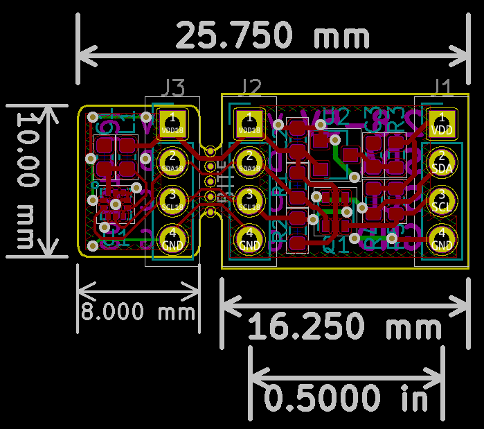

# ICP-101xx Library and Breakout Board

The TDK InvenSense ICP-101xx is a family of very low power, very high accuracy barometric pressure sensors. These sensors can measure pressure difference of as little as +/- 1 Pascal, which is equivalent to altitude differences of 8.5cm.


Documentation by TDK InvenSense:
* Product pages and datasheets: [TDK InvenSense](https://invensense.tdk.com/smartpressure/)
* Application Note: [Differential Pressure Sensing for Drones](https://www.invensense.com/download-pdf/an-000119-differential-pressure-sensing-using-icm-20789-for-altitude-hold-in-drones/)

Besides the [library for Arduino](#arduino-library), this repository also includes basic libraries compatible with the STM32 HAL [here](./extras/stm32-hal) and Mbed OS [here](./extras/mbed), and KiCad projects for [two breakout boards](#breakout-boards).

## Arduino Library

The Arduino library ICP101xx provides a simple API to read temperature and pressure. The library was developed and tested with the ICP-10100 and ICP-10125 but should also work with other sensors of the family.

The library includes 3 examples that demonstrate its use.

### The ICP101xx Object

Use the `ICP101xx` object to create an instance of the sensor. For example, by declaring a global variable:

```
ICP101xx mysensor;
```

### begin()

To initialize the sensor, use the `begin` method.

```
mysensor.begin();
```

By default, the sensor will use the Arduino `Wire` object for I2C. If you want to use the sensor on a different I2C port, pass a pointer to the `Wire` object the library should use. For example:

```
mysensor.begin(&Wire1);
```

The `begin` method connects to the sensor and reads the calibration data. It will return `false`, if the sensor does not respond. This can be used for error handling.

```
if (!mysensor.begin()) {
	// sensor did not respond, do error handling here
}
```

### isConnected()

This method is used to check whether the sensor is responding. This method returns `true` if the sensor can be reached.

```
if (mysensor.isConnected()) {
	// do some measurements
} else {
	// report an error
}
```

`isConnected` will return false in the following situations:

- No response from the sensor. Check your connections and pull-up resistors.
- Sensor responds with an unknown or unsupported device ID.

### measure()

The method `measure` performs a measurement and doesn't return control until the measurement is completed.

The time to complete a measurement depends on the selected sensor mode that can be passed as an optional parameter. The options are:

|Mode|Duration|Noise|[Sensor Mode](http://www.invensense.com/wp-content/uploads/2019/02/DS-000186-ICP-101xx-v1.1.pdf#%5B%7B%22num%22%3A12%2C%22gen%22%3A0%7D%2C%7B%22name%22%3A%22XYZ%22%7D%2C34%2C530%2C0%5D)|Notes|
|--|--|--|--|--|
|FAST|3 ms|±3.2 Pa|Low Power (LP)| |
|NORMAL|7 ms|±1.6 Pa|Normal (N)|default|
|ACCURATE|24 ms|±0.8 Pa|Low Noise (LN)| |
|VERY_ACCURATE|95 ms|±0.4 Pa|Ultra Low Noise (ULN)| |

```
mysensor.measure(mysensor.VERY_ACCURATE);	// high accuracy measurement
// process data
```

If mode is not specified, NORMAL will be used.

```
mysensor.measure();	  // normal measurement
// process data
```

### measureStart(), dataReady()

Sometimes you may not want to wait idly until a measurement is complete but do something useful while the sensor is busy. Especially when using the VERY_ACCURATE mode, which takes almost 100ms to complete.

`measureStart` initiates a new measurement and immediately returns control to the calling program. Like the method `measure`, an optional parameter can be used to specify the accuracy. You can then use `dataReady` to check whether the sensor completed its task.

```
mysensor.measureStart(mysensor.VERY_ACCURATE);
while (!mysensor.dataReady()) {
	// do some other useful stuff
}
// the sensor is done, process the data
```

### getPressurePa()

When measurement is complete, the result is stored in the sensor object and can be read with the `getPressurePa` method.

`getPressurePa` returns the pressure in Pascal (Pa) as a `float`.

```
mysensor.measure();
Serial.print("Pressure is ");
Serial.print(mysensor.getPressurePa());
Serial.println(" Pa");
```

Pascal is mostly of interest to measure tiny pressure differences. For absolute pressure, you may want to apply some simple math.

|Target unit|Formula|
|--|--|
|hPa|Pa / 100|
|mbar|Pa / 100|
|mmHg|Pa / 133.322365|
|inHg|Pa / 3386.389|
|atm|Pa / 101325|

### getTemperatureC(), getTemperatureF()

The ICP-101xx also includes a very precise temperature sensor with an absolute accuracy of ±0.4 Celsius. The temperature is sampled together with the pressure during each measurement cycle. Use `getTemperatureC` or `getTemperatureF` to get the temperature as `float` in Celsius or Fahrenheit respectively.

```
mysensor.measure();
Serial.print("The current temperature is ");
Serial.print(mysensor.getTemperatureF());
Serial.println(" Fahrenheit");
```

## Breakout Boards

This repository includes the design files for two styles of breakout boards in the folder [extras/KiCad](./extras/KiCad). These breakout boards were designed with Kicad 5.x. 

The ICP-101xx is a 1.8V part, but the boards include a voltage regulator and I2C level-shifter. This allows to interface the sensor to 2.8V, 3.3V or 5V logic.

Soldering the sensor requires a solder paste stencil and reflow oven or hotplate, though experienced tinkerers may manage to assemble it only using a hot air station.

Contact me if you are interested in buying populated and tested breakout boards, I may have a few at hand. There's also an inexpensive breakout board by [Mikroe](https://www.mikroe.com/altitude-3-click) (search `MIKROE-3328` on Digi-Key, Mouser and other distributors), which should work with this library.

### Breakout Style



The sensor can be separated from the rest of the breakout board, for example to put into confined and/or exposed spaces.


You can order the PCB on [OSH Park](https://oshpark.com/shared_projects/2vvKCdQE)

### Probe Style

A probe style breakout board, ideal to shove the sensor into narrow places.


This design works best with very thin or flexible PCB material.


You can order the PCB on [OSH Park](https://oshpark.com/shared_projects/IjXrtBOE)
